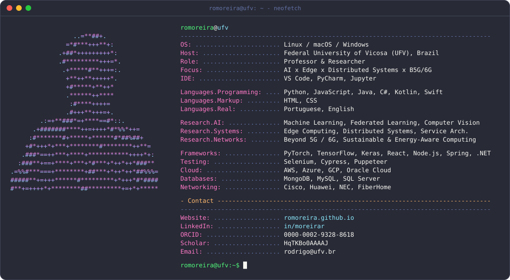

<!--
  Perfil estilo "terminal / neofetch".
  Requisitos:
    - commite  profile.svg  na RAIZ do repo do seu perfil  (romoreira/romoreira)
    - o SVG e uma imagem: cores funcionam, mas LINKS dentro dele NAO sao clicaveis
      -> por isso mantemos a linha de badges (clicaveis) logo abaixo.
  Dica: se atualizar o profile.svg e o GitHub mostrar a versao antiga,
        e so cache -> aguarde alguns minutos ou de refresh forcado (Ctrl/Cmd+Shift+R).
-->

  

  
  
  
  

<!-- ================= Stats dinamicos (numeros reais, sempre atualizados) ================= -->

  

  

  

